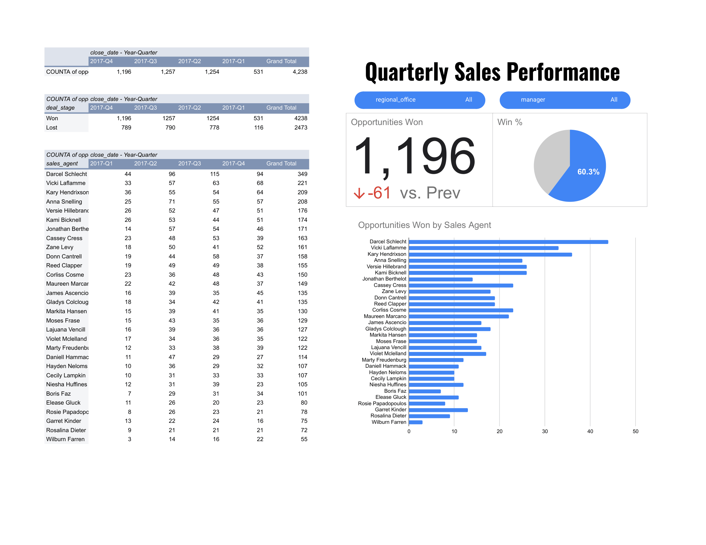

# 📊 Sales Pipeline Analysis Dashboard



## Overview

A comprehensive **Sales Pipeline Analytics** project that transforms raw CRM opportunity data into actionable business intelligence. This dashboard provides quarterly performance tracking, win/loss analysis, and agent-level leaderboards to support data-driven sales strategy decisions.

---

## 🔍 Key Insights

- **4,238** total opportunities tracked across 2017 Q1–Q4
- **60.3% Win Rate** — 1,196 opportunities closed won in Q4 alone
- **↓ -61** opportunities vs. previous quarter, signaling pipeline fluctuation
- Top performer **Darcel Schlecht** closed **349 deals** across all quarters
- Win/Loss breakdown enables targeted coaching and territory optimization

---

## 📁 Project Structure

```
sales-pipeline-analysis/
│
├── data/
│   └── sales_pipeline.xlsx        # Raw opportunity data
│
├── dashboard/
│   └── sales_dashboard.png        # Quarterly performance dashboard
│
├── analysis/
│   └── pipeline_analysis.ipynb    # Jupyter Notebook (EDA & visualization)
│
└── README.md
```

---

## 📈 Dashboard Features

| Feature | Description |
|---|---|
| **Opportunities Won** | Total won deals with QoQ delta indicator |
| **Win Rate (%)** | Visual pie chart of won vs. lost ratio |
| **Quarterly Pivot Table** | Deal counts by stage and quarter |
| **Agent Leaderboard** | Bar chart ranking all agents by closed-won volume |
| **Filter Controls** | Slice by regional office and manager |

---

## 🛠️ Tools & Technologies

- **Microsoft Excel** — Pivot tables & interactive slicers
- **Python / Pandas** *(optional analysis layer)*
- **Data Visualization** — Bar charts, KPI cards, pie charts

---

## 🚀 Getting Started

1. Clone this repository:
   ```bash
   git clone https://github.com/OmarHossam-1/sales-pipeline-analysis.git
   ```
2. Open `data/sales_pipeline.xlsx` in Excel or import into your BI tool of choice.
3. Explore the dashboard tab for pre-built visuals and slicers.

---

## 📊 Data Dictionary

| Column | Description |
|---|---|
| `opp` | Opportunity ID |
| `deal_stage` | Won / Lost |
| `close_date` | Date the deal was closed |
| `sales_agent` | Name of the assigned sales representative |
| `regional_office` | Office region associated with the deal |
| `manager` | Sales manager overseeing the agent |

---

## 👤 Author

**Omar Hossam**
- 🔗 LinkedIn: [linkedin.com/in/omarhossam1](https://www.linkedin.com/in/omarhossam1)
- 🐙 GitHub: [github.com/OmarHossam-1](https://github.com/OmarHossam-1)

---

## 📄 License

This project is open source and available under the [MIT License](LICENSE).
